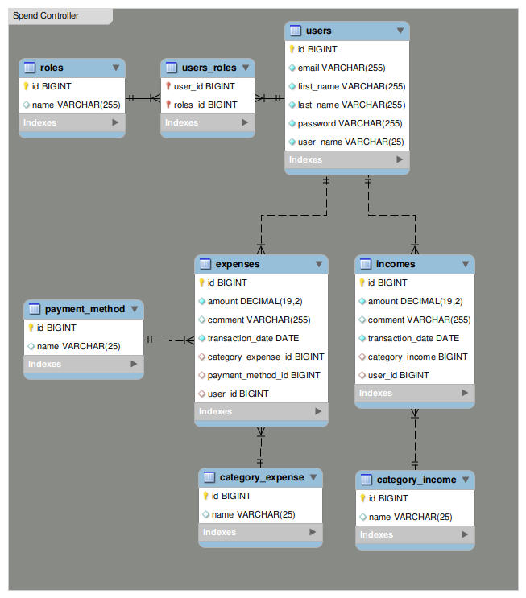

# Spend Controller
>Purpose for creating this application  was the desire to keep spend under control, generate savings, understand budget leaks.

## Video
https://drive.google.com/file/d/13Vh4NheiN34qvVLiudtml2OvC4Tq_k40/view?usp=sharing

## Table of elements
* [Description](#description)
* [Technogy Stack](#technogy-stack)
* [Functionality](#functionality)
* [Database structure](#database-structure)

## Description
>If you have ever faced money leakage out of your pocket, this is the tool for you. It has been designed to help people manage home budget more effectively. It
equips user tracking day-to-day incomes/expenses and  allow analyse the results afterwards. 

## Technogy Stack
* Java
* Spring boot
* Spring data
* Spring security
* Hibernate
* MySql
* Thymeleaf
* Bootstrap

## Functionality
* register
* login with secured password
* granting system permission for user (ROLE)
* incomes management – CRUD
* expenses management – CRUD
* categories management – CRUD (different categories for income/expense)
* payment terms management – CRUD
* compare money flow per category
* see the balance

#### To do
* get results for defined period of time
* export results to pdf
* visualization chart – JavaScript D3

## Database structure

